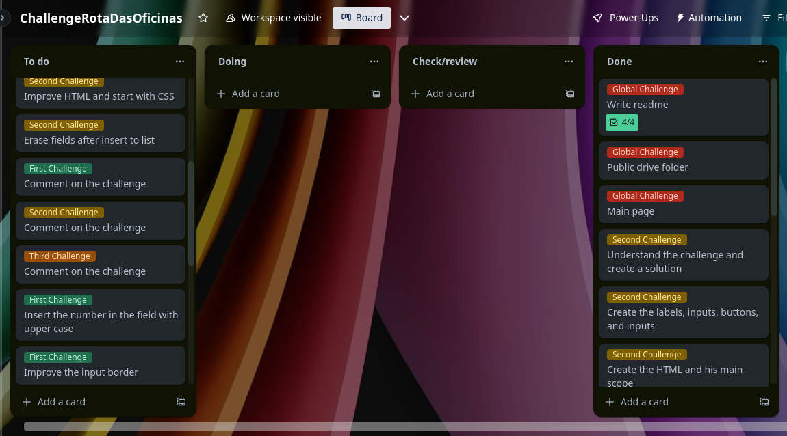

# ChallengeRotaDasOficinas

You can see this project on [GitHub](https://github.com/wilknisoliveira/ChallengeRotaDasOficinas.git)

## Introduction
This project aims to provide three interactive challenges as part of a selective process from **Rota das Oficinas**. The challenges include a Roman numerals converter, an implementation of the Game of Life by Horton Conway, and a bill division application for restaurants.

## Installation and Usage
To run the project locally 💻, follow these steps:

1. Clone the repository to your local machine.
2. Open the index.html file in a web browser.
3. On the index page, you will find links to each challenge. Click on the respective link to access and interact with each challenge.

## Challenges
1. Roman Numerals Converter
The Roman numerals converter allows users to convert decimal numbers into their equivalent Roman numeral representation, and vice versa. Enter a decimal number 🔢 in the provided input field, press the **Generate button** and the converter will display the corresponding Roman numeral. To make the counter, press **Toggle button**.

2. Game of Life
The Game of Life, developed by Horton Conway, is a cellular automaton simulation 🦠. In this challenge, users can observe the evolution of cells based on a set of predefined rules. Interact with the grid by clicking on cells to toggle their state, press the **Next Gen button**, and observe how they evolve in the next generation.

3. Restaurant Bill Division
    - The Restaurant Bill Division 😋 challenge assists users in dividing a restaurant bill among a group of people. 
    - First, enter all consumed products with price and quantity;
    - Enter all the costumers that will pay anything. Inform if the client will pay fee;
    - At Consumption List, enter each product followed by the customers.
    - Press division button and see the result 💵.

## Additional Information
- The project was completed within a limited time of 2 days ⏰. So following the principles of the SCRUM methodology, I tried to deliver the maximum product value in this unique Sprint.
- The primary focus during development was on backend functionality. Visual elements may be minimal or have a basic appearance 🐛.
- The project was managed using Trello, utilizing a Kanban board to track and prioritize tasks.

- All this is hosted on GitHub, where commits were made regularly to ensure a secure development process and maintain version control.
- I appreciate your attention. Feel free to make comments and help me 🙏 to improve my dev skills.
- It will be a pleasure if you like this challenge results. And it will be AMAZING if you accept me has part of this **AMAZING** team ❤️!
